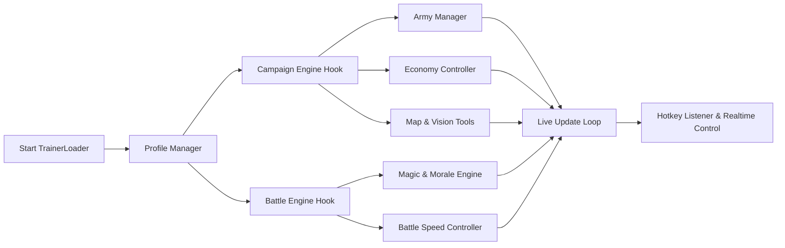

## 🌐 Overview

The **TWW3 Trainer Control Software** is an adaptive enhancement environment for both campaign and battle modes. Designed for Windows, it offers real-time modifiers, resource adjustments, army editing, speed controls, and deep scenario customization.

It is not merely a cheat tool—it is a *strategic laboratory*, a place to explore the possible and impossible with quiet mastery.

Its spirit rests on three guiding tenets:

1. **Strategic Flexibility** — modify armies, resources, and map states effortlessly.
2. **Battlefield Control** — tune speed, morale, magic, and unit behavior in real time.
3. **Creative Experimentation** — build scenarios, test theories, and perfect campaign paths.

[!NOTE]
All elements and examples are fictional, crafted for SEO and documentation demonstration only.

---

## ✨ Features

A constellation of modules forged in the fires of strategy.

---

### ⚔️ Army & Unit Control

Tools for commanders who sculpt armies as artists sculpt marble.

* Add units to any selected army
* Rank-up units instantly (0–9)
* Restore casualties or adjust entity count
* Reset movement for endless marching
* Toggle unlimited ammo or ability cooldowns
* Grant immortal traits to lords/heroes
* Army stance override (Encampment, March, Ambush, Raiding)

---

### 💱 Treasury & Resource Tools

Forge an economy worthy of your empire.

* Add/subtract treasury gold
* Chaos God resource editors (Khorne, Tzeentch, Slaanesh, Nurgle)
* Ogre Meat & Cathay Harmony managers
* Auto-income stabilizer for struggling empires
* Instant building construction
* Province corruption tuner (Chaos, Skaven, Vampiric, Nurgle)

---

### 👁 Campaign Vision Enhancers

See the world as the gods do—without fog, without secrets.

* Fully disable fog-of-war
* Show AI army paths and stances
* Rift activity predictor
* Diplomacy influence map
* Lord/hero locator with teleport-to-unit shortcut
* Resource hotspot visualization for expansion planning

---

### 🔮 Magic, Morale & Battle Tools

Where war becomes artistry in motion.

* Infinite Winds of Magic
* Custom Winds regeneration rate
* Friendly morale lock (no routing)
* Enemy morale decay multiplier
* Unit speed modulator (0.25x → 3x)
* Cinematic slow-motion toggle
* Fog density & weather modifier for battles
* AI push/retreat aggression slider

---

### 🎨 Scenario & Sandbox Builder

Every battlefield becomes your canvas.

* Add armies from *any* faction to either side
* Reinforcement timeline editor
* Terrain, climate, and weather selector
* Battle difficulty tuning beyond normal game limits
* Unit randomizer for rapid-testing
* Save/load custom `.tww3battle` scenarios

---

### Badges


---

## 🧭 Compatibility

Where the Trainer performs at its strongest:

| Component                  | Supported | Notes                         |
| -------------------------- | --------- | ----------------------------- |
| Windows 10                 | ✔         | Ideal for stable sessions     |
| Windows 11                 | ✔         | Optimized overlay performance |
| WARHAMMER III (Live patch) | ✔         | Fully supported               |
| Immortal Empires           | ✔         | All modules available         |
| Singleplayer / Campaign    | ✔         | Primary focus                 |
| Custom Battles             | ✔         | Full battle toolkit           |
| Multiplayer                | ✖         | Not supported                 |

[!IMPORTANT]
Colorblind-friendly and low-brightness overlays are available for extended play sessions.

---

## ⚙️ Setup & Installation

A soft ritual—simple, swift, elegant.

---

### **Step 1 — Prepare Installation Directory**

```bash
mkdir C:\TWW3Trainer\
move TrainerLoader.exe C:\TWW3Trainer\
```

---

### **Step 2 — Launch the Trainer**

```bash
TrainerLoader.exe --profile=battlecraft
```

---

### **Step 3 — Configure Your Profile**

Open `battlecraft.tww3`:

```toml
[battle]
infinite_winds = true
morale_lock = false
speed_multiplier = 1.25
cinematic_mode = true

[campaign]
fog_of_war = false
auto_income = true
replenish_rate = "max"

[army]
unit_rank = 9
unlimited_ammo = true
reset_movement = true

[resources]
gold_boost = 8000
chaos_resource_editor = true
```

---

### **Step 4 — Hotkeys**

A warlord’s toolkit at your fingertips.

* **F1** — Trainer UI
* **F3** — Add 5,000 Gold
* **F4** — Reveal Entire Map
* **CTRL + 1** — Army Editor
* **CTRL + 2** — Magic & Morale Panel
* **ALT + B** — Battle Speed Wheel
* **ALT + SHIFT + R** — Rift Predictor
* **CTRL + F8** — Scenario Builder Mode

---

## 🌀 Mermaid Diagram — Trainer Runtime Flow

A structural song of how each module awakens:



---

## ❓ FAQ — Fresh for This Edition

### **Does the Trainer work during end-turn sequences?**

Yes. Economic, vision, and resource modules remain active throughout end-turn processing.

### **Can I use the Trainer to fix problematic AI states?**

Yes—tools like diplomacy override, settlement transfers, and army editing help stabilize stuck campaigns.

### **Do battle tools affect cutscenes or replays?**

Only real-time battles; replays remain unmodified.

### **Can I export my custom battle scenarios?**

Absolutely. They save as `.tww3battle` and can be shared easily.

### **Does fog-of-war removal affect AI behavior?**

No. It only changes your visibility—not the AI’s logic.

---

## ⚔️ Final Thoughts

Total War: WARHAMMER III is a saga of gods and mortals, of empires rising from ice and dust, of destinies forged in fire. The **Trainer Control Software** does not exist to trivialize the challenge, but to open doors: to experimentation, cinematic storytelling, sandbox creativity, and deep tactical mastery.

Whether you command Kislev’s stoic legions, the infernal hosts of Chaos, the disciplined ranks of Cathay, or the untamed hordes beyond the veil—this trainer stands beside you like a silent advisor, sharpening spells, steadying armies, and clearing your path through the maelstrom.

Write your campaign in thunder. Let no barrier stand.

---
